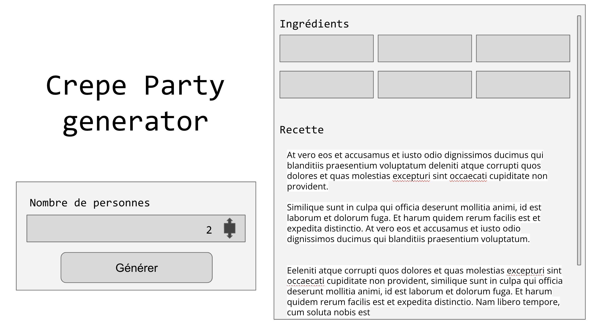

# Crepe party generator 

Vous invitez tous vos amis pour un goûter demain à l’occasion de Mardi gras.
 
Seulement, vous n’avez la recette de la pâte à crêpes que pour une personne...

Votre objectif est de créer un programme qui calcule automatiquement les ingrédients à utiliser pour X personnes.

**Pour 1 personne**
- 63g de farine
- 1 oeuf
- 0.2 L de lait
- 0,5 c à s de sucre
- 13g de beurre

## La maquette
Vous trouverez ci dessous la maquette du *Crepe Party Generator*

Le code contient également une version "V1" de la grille de cette web application. 

Retrouvez la grille sur grid.layoutit.com (https://grid.layoutit.com/?id=zehjXlo)

## Objectifs
### Front-End
- Votre premier objectif est l'ajout de tous les éléments manquants au DOM. 
- Par exemple, ou allez-vous ajouter les résultats après le calcul des quantités ? 
- Ajoutez également le champ <input type="number"> qui vous servira à incrémenter le nombre de participants

### Javascript 
- Ajoutez un écouteur d'événements au champ input
- Éxécutez une fonction à chaque fois que le champ est modifié 
- Calculez la recette dans cette fonction

### Ajoutez au DOM !
- Ajoutez le.s résultat.s de cette fonction au DOM dans les rectangles en dessous de "Ingrédients" 

### Bon courage 💪🏻

------- 

